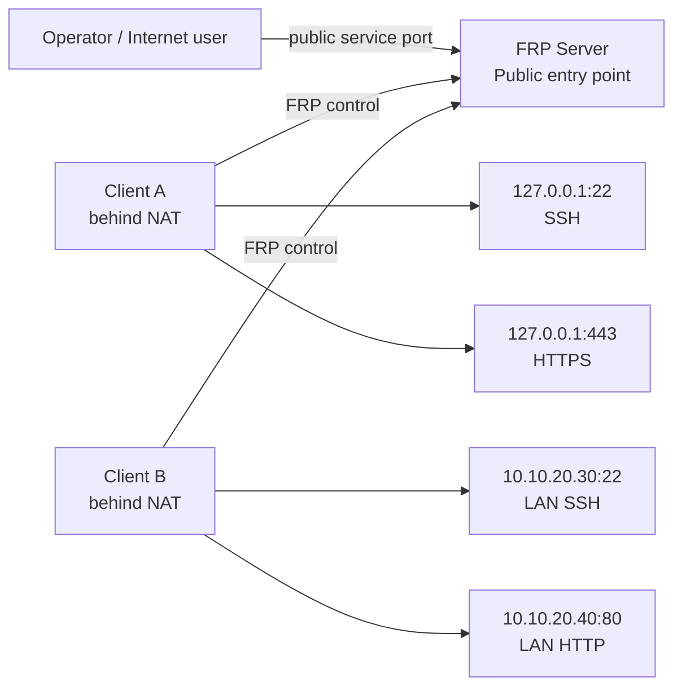
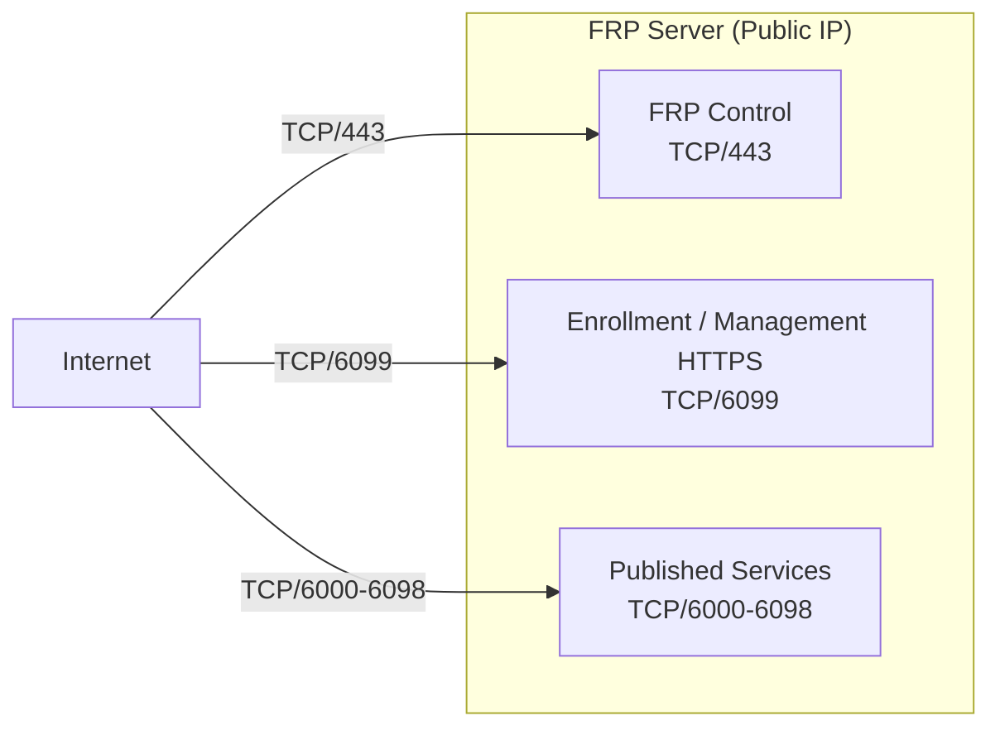
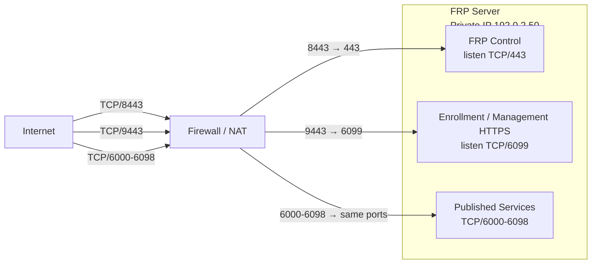
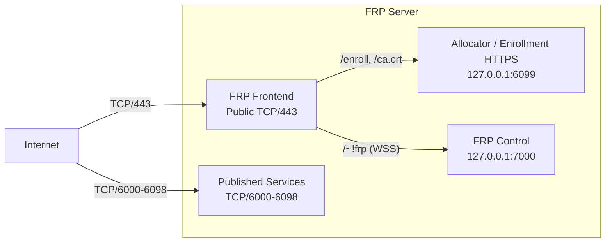
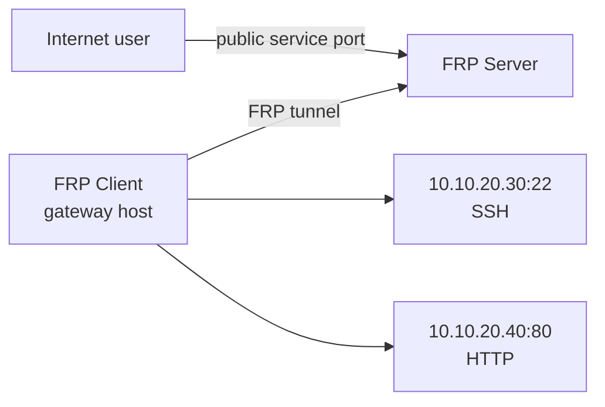

# frp-auto-deploy

`frp-auto-deploy` is a lightweight deployment and operations layer for the official
[fatedier/frp](https://github.com/fatedier/frp) binaries. It does **not** fork or
modify FRP.

It solves the operational work around FRP:

- install and update `frps` / `frpc`
- enroll remote clients securely over HTTPS
- assign persistent public TCP ports
- publish one or many services from each client
- manage clients and services with a single operator CLI: `frpctl`
- preserve identity, CA, token, registry, and port reservations across normal updates
- provide backup / restore, diagnostics, audit events, and release-safe lifecycle controls

> Example addresses such as `203.0.113.10`, `192.0.2.50`, and `198.51.100.10`
> are documentation-only RFC 5737 addresses. Replace them with your own values.

## Release status

| Item | Current |
| --- | --- |
| Stable project release | **v2.1.0** |
| Candidate release | **v2.1.1** (pending independent review / real OCI E2E / release) |
| Pinned / tested FRP | **v0.70.1** |
| Default deployment mode | **Direct** |
| Optional enterprise mode | **single-443** |
| Stable install source | immutable **v2.1.0** tag |
| Candidate install source | exact commit SHA only (not a published tag yet) |
| `main` branch | development channel; may contain post-v2.1.0 changes |

Current project version: **2.1.1** (candidate)
Current pinned FRP version: **v0.70.1**

**v2.1.0** is the current stable release on GitHub. **v2.1.1** is a pre-release
candidate in this tree; it is not tagged or published as stable until independent
review and real OCI E2E complete. Stable installs use the immutable **v2.1.0** tag.
Candidate builds require an exact verified commit SHA. Following mutable `main` is
explicit opt-in only, for example `FRP_RELEASE_CHANNEL=dev`.

On development builds, use release channel, source ref, and verified
bundle SHA256 to identify the exact build.

FRP **0.71.x is not automatically adopted**. `show upstream` is informational;
the project remains pinned to the version that has been tested.

---

# 1. The mental model

A client can sit behind NAT or a firewall and still publish local or LAN services
through one public FRP server.



The FRP server does not need to know how an application works. It publishes TCP
connections. SSH, HTTP, HTTPS passthrough, and custom TCP are all represented as
services.

A typical client may therefore be:

- **SSH only** — publish the client's own `127.0.0.1:22`
- **multiple local services** — SSH + HTTPS from the same client
- **a small gateway** — publish services on other hosts reachable from the client,
  for example `10.10.20.30:22` and `10.10.20.40:80`

---

# 2. Choose the deployment pattern

There are only **two deployment modes**: `direct` and `single443`.

**NAT is a network topology, not a deployment mode.**
A Direct server can have a public IP or sit behind a firewall/NAT.

| Environment | Recommended pattern | Public inbound TCP |
| --- | --- | --- |
| Public-IP server, normal firewall policy | Direct, default ports | `443`, `6099`, `6000-6098` |
| Server behind firewall / NAT | Direct with public/listen port split | example `8443`, `9443`, `6000-6098` |
| Enterprise network that strongly prefers TLS on 443 | Enterprise single-443 | `443`, `6000-6098` |

## 2.1 Public-IP server — Direct defaults



Default Direct values:

```text
FRP control       public 443  = listen 443
Allocator HTTPS   public 6099 = listen 6099
Published ports   6000-6098
```

## 2.2 Server behind firewall / NAT — Direct with port split

Example: public `8443` and `9443` are translated to the private FRP server.



Example DNAT:

```text
203.0.113.10:8443       -> 192.0.2.50:443
203.0.113.10:9443       -> 192.0.2.50:6099
203.0.113.10:6000-6098  -> 192.0.2.50:6000-6098
```

Clients always use the **public** endpoints:

```text
FRP control : 203.0.113.10:8443
Enrollment  : https://203.0.113.10:9443/enroll
SSH example : ssh -p 6000 user@203.0.113.10
```

See [examples/pfsense-firewall.md](examples/pfsense-firewall.md).

## 2.3 Enterprise single-443

Use this when a corporate network allows TCP connectivity to non-standard ports
but resets TLS ClientHello there, or when policy strongly prefers control and
enrollment on TCP/443.



Public inbound:

```text
TCP/443        HTTPS enrollment + FRP control over WSS
TCP/6000-6098 published services
```

Internal only:

```text
127.0.0.1:6099 allocator backend
127.0.0.1:7000 FRP control backend
```

**Do not publish 6099 or 7000 in single-443 mode.**

More detail: [docs/DEPLOYMENT_MODES.md](docs/DEPLOYMENT_MODES.md)

---

# 3. Install the server

For a stable installation, use the immutable **v2.1.0** bundle:

```bash
curl -fsSL \
  https://raw.githubusercontent.com/datarelay-labs/frp-auto-deploy/v2.1.0/dist/bootstrap-server.sh \
  | sudo bash
```

**v2.1.1 candidate** builds are not published as a GitHub tag yet. Use the
candidate release channel with an exact verified commit SHA, not a mutable branch.

A fresh interactive install asks for the values in this order:

| Step | Prompt | Typical Direct default | single-443 default |
| --- | --- | --- | --- |
| 1 | Public hostname or IP | detected public IP | detected public IP |
| 2 | Internal FRP server IP | detected private IP | detected private IP |
| 3 | Deployment mode | `Direct` | choose `Enterprise single-443` |
| 4 | Public FRP control port | `443` | `443` |
| 5 | FRP listen/backend port | `443` | `7000` |
| 6 | Public enrollment HTTPS port | `6099` | `443` |
| 7 | Allocator listen/backend port | `6099` | `6099` |
| 8 | Published service range | `6000-6098` | `6000-6098` |
| 9 | Allocator public URL | derived HTTPS URL | derived `https://host/enroll` |

The installer stores runtime settings in:

```text
/etc/frp-auto-deploy/config.json
```

It does **not** configure OCI Security Lists, AWS security groups, UFW,
firewalld, iptables, or external NAT. Open or translate the ports required by
the deployment pattern you selected.

Useful non-interactive variables:

```text
FRP_PUBLIC_HOST
FRP_INTERNAL_IP
FRP_DEPLOYMENT_MODE              direct | single443
FRP_CONTROL_PUBLIC_PORT
FRP_CONTROL_LISTEN_PORT
FRP_ALLOCATOR_PUBLIC_PORT
FRP_ALLOCATOR_LISTEN_PORT
FRP_ALLOCATOR_PUBLIC_URL
FRP_PORT_START
FRP_PORT_END
FRP_CONFIRM_MODE_SWITCH          yes, for non-interactive mode cutover
```

Switching Direct ↔ single-443 is a maintenance-window cutover, not a
zero-downtime operation.

## Verify the server

```bash
sudo frpctl show version
sudo frpctl show status
sudo frpctl doctor
```

For single-443 you should see:

```text
frps       : active
allocator  : active
frontend   : active

FRP control public : <public-host>:443
FRP control local  : 127.0.0.1:7000
Allocator public   : https://<public-host>/enroll
Allocator local    : 127.0.0.1:6099
```

`doctor` is read-only and performs deeper installation, security, state,
runtime, and network consistency checks.

---

# 4. Enroll a client

There are two normal first-install workflows:

1. **Zero-touch** — server generates one command for the remote machine
2. **Manual Enrollment Code** — operator creates an Enrollment Code and the client
   chooses services interactively

Enrollment establishes a persistent client management identity. Normal later
service changes and software updates do **not** require re-enrollment.

## 4.1 Zero-touch SSH

On the server:

```bash
sudo frpctl create enrollment \
  --one-line \
  --ssh \
  --ssh-user aella \
  --label branch-a
```

The SSH account must already exist on the client. There is **no default username**:
do not assume `ubuntu`, `root`, or any distro-specific account.

Interactive creation may prompt:

```text
Client SSH user: aella
SSH port [22]: 22
```

Zero-touch does **not**:

- create an OS user
- install or enable an SSH server
- set a password
- create or modify SSH keys / `authorized_keys`
- change `sshd_config`

The server prints a one-time install command containing a short-lived bootstrap
ticket. Send that command securely to the remote operator and run it once.

After enrollment:

```bash
sudo frpctl show clients
sudo frpctl show enrollments
```

Connect with the assigned public service port:

```bash
ssh -p <public-port> aella@203.0.113.10
```

## 4.2 Manual Enrollment Code

On the server:

```bash
sudo frpctl create enrollment
```

The output includes:

- a non-secret Enrollment ID for tracking/revocation
- a short-lived Enrollment Code shown at creation time
- the allocator HTTPS URL
- the allocator CA SHA256 fingerprint
- the client bootstrap command

Copy the generated client install command **as printed**. On the client, run it
and enter the Enrollment Code when prompted.

The client then opens a service menu:

```text
1) SSH
2) HTTP
3) HTTPS
4) Custom TCP
5) Back
```

The FRP server assigns public service ports automatically. The client chooses
the **target host and target port**, not the external public port.

---

# 5. Common client scenarios

## Scenario A — publish only the client's SSH

During the first manual enrollment:

```text
Type        : SSH
Service ID  : ssh
Target host : 127.0.0.1
Target port : 22
SSH user    : aella
```

Result:

```text
Internet -> FRP Server:<assigned-port> -> client 127.0.0.1:22
```

## Scenario B — publish SSH + local HTTPS

Add two services before selecting **Install and connect**:

```text
Service 1
  Type        : SSH
  Service ID  : ssh
  Target      : 127.0.0.1:22

Service 2
  Type        : HTTPS
  Service ID  : web-admin
  Target      : 127.0.0.1:443
```

Each service gets its own persistent public port.

HTTPS is TCP passthrough. FRP does not terminate the application's HTTPS
session.

## Scenario C — use the client as a gateway to other LAN hosts

The FRP client does not have to publish a service running on itself.

Example:

```text
Service 1
  Type        : SSH
  Service ID  : lan-ssh
  Target      : 10.10.20.30:22

Service 2
  Type        : HTTP
  Service ID  : lan-web
  Target      : 10.10.20.40:80
```

Flow:



The FRP client only needs normal IP reachability to those internal targets.

## Scenario D — custom TCP service

Examples:

```text
Grafana       127.0.0.1:3000
API           10.10.30.20:8080
PostgreSQL    10.10.30.30:5432
Appliance UI  10.10.40.50:8443
```

Choose **Custom TCP**, give the service a stable Service ID, and enter the target
host/port.

---

# 6. `frpctl` — the everyday operator CLI

For normal operations, remember one command:

```bash
sudo frpctl
```

`frpctl` starts a persistent interactive CLI.

```text
Tab   show or complete valid next tokens immediately
?     context-sensitive help
help  full command help
↑/↓   in-memory history for this session only
menu  guided numbered menu
exit  leave the CLI
```

Grammar:

```text
<verb> <resource> [target] [property] [value]
```

The canonical server-side client selector is immutable **CLIENT ID**. Label and
hostname are convenient shortcuts, but changing metadata never changes the
CLIENT ID.

## Server examples

```text
show status
show version
show clients
show clients --group <GROUP>
show client <ID>
show client <ID> services
show client <ID> tags
show client <ID> groups
show groups
show group <GROUP>
show group <GROUP> clients
show enrollments
show audit
show upstream

set client <ID> label production-gateway
set client <ID> note "Seoul office gateway"
set client <ID> tag site seoul
set group <GROUP> name acme-korea
set group <GROUP> description "ACME customer systems"

unset client <ID> label
unset client <ID> note
unset client <ID> tag site

create enrollment
create enrollment --one-line --ssh --ssh-user aella --label branch-a
create enrollments --count 3
create group customer-acme
create backup

add client <CLIENT-ID> group <GROUP>
remove client <CLIENT-ID> group <GROUP>
remove group <GROUP>

revoke enrollment <ID>
revoke client <CLIENT-ID>

release service <CLIENT-ID> <service-id>
release client <CLIENT-ID>

update project --check
update project
update frp --check

doctor
```

## Client examples

```text
show status
show version
show services
show info

add service
set service <service-id> target-host <host>
set service <service-id> target-port <port>
set service <service-id> ssh-user <user>
set service <service-id> name <value>

enable service <service-id>
disable service <service-id>

apply
discard

update project --check
doctor
```

Client service edits are staged. Use `apply` to make them live or `discard` to
drop pending changes.

Full reference: [docs/CLI_REFERENCE.md](docs/CLI_REFERENCE.md)

---

# 7. Lifecycle semantics — important

These operations are deliberately different:

```text
disable   != release
revoke    != release
uninstall != release
uninstall != purge
update    != re-enrollment
```

| Operation | What it does | Public port reservation |
| --- | --- | --- |
| `disable service` | temporarily stops publishing the service | **kept** |
| `enable service` | republishes the service | **same port reused** |
| edit + `apply` | changes target/name/config | **kept when possible** |
| `revoke client` | removes management identity / blocks management | **kept** |
| `release service` | returns one service's public port | **released** |
| `release client` | frees all service reservations; keeps the management record | **released** |
| client uninstall | removes local client state only | **server ports remain** |
| server uninstall | removes runtime/software | state is preserved |
| server purge | destructive server cleanup | state deleted |

There is intentionally no ambiguous `delete client` command. If you mean
"free the public ports while keeping the management record", use `release client`.

---

# 8. Backup, restore, and updates

## Backup / restore

On the server:

```bash
sudo frpctl create backup
sudo frpctl restore backup <path>
```

Backup/restore covers project state such as configuration, registry, enrollment
metadata, token, and PKI according to the documented backup format.

## Project update

Check first:

```bash
sudo frpctl update project --check
```

Then update:

```bash
sudo frpctl update project
```

The updater verifies release metadata and `SHA256SUMS`. Same-version updates are
identified by verified bundle SHA256, not by `PROJECT_VERSION` alone. This
allows a development build to refresh management code without falsely reporting
"not needed" only because both trees say the same `PROJECT_VERSION`.

A normal project update does not re-enroll clients or intentionally rotate the
CA, FRP token, client identity, or persistent service ports.

Legacy clients that do not have persisted release identity fail closed on remote
update. Use the **one-time verified bridge** documented in
[docs/FRP_UPGRADE.md](docs/FRP_UPGRADE.md); do not guess or silently switch a
legacy install to a release channel.

## FRP binary update

```bash
sudo frpctl show upstream
sudo frpctl update frp --check
```

`show upstream` may report a newer upstream FRP release. That does not mean the
project will install it. Only the pinned/tested FRP version is accepted by the
normal update path.

---

# 9. Security model

The management plane is designed to fail closed.

- Enrollment and management use **HTTPS only**
- The server maintains a project private CA
- First client trust uses a supplied **CA SHA256 fingerprint** and X.509 parsing
- Later management requests use the stored CA
- Clients receive a persistent ECDSA management identity after enrollment
- Remote client OS clocks do not need to match the FRP server exactly; enrollment
  uses server-issued challenges and management uses a stored server-relative offset
  (the installer never changes system time)
- FRP data/control authentication still uses the FRP token
- Zero-touch bootstrap tickets are short-lived and sensitive
- `show enrollments`, Tab completion, help, status, and audit views do not expose
  enrollment secrets
- `frpctl` history is session-only and is not written to disk
- `frpctl` tokenization does not perform shell variable expansion, globbing, or
  command substitution
- Plain HTTP allocator operation is not supported
- Production verification should not disable TLS verification
- Installer bundles are covered by `SHA256SUMS`; this project does not currently
  ship cryptographic signatures for its own bootstrap scripts

Security details: [docs/SECURITY.md](docs/SECURITY.md)

---

# 10. Supported platforms and validation

Automated userspace/container portability is exercised on:

| Distribution | Automated container matrix |
| --- | --- |
| Ubuntu 22.04 | PASS |
| Ubuntu 24.04 | PASS |
| Rocky Linux 9 | PASS |
| AlmaLinux 9 | PASS |
| Amazon Linux 2023 | PASS |
| Amazon Linux 2 | PASS |

Real-environment validation and container validation are **not the same claim**.
For example, SELinux Enforcing, native ARM64 systemd, and some older OpenSSL
environments have separate validation gates.

See [docs/RELEASE_VALIDATION.md](docs/RELEASE_VALIDATION.md) for the authoritative
support/validation classification.

---

# 11. Useful files and services

Server:

```text
/etc/frp/frps.toml
/etc/frp/server_token
/etc/frp-auto-deploy/config.json
/etc/frp-auto-deploy/version
/etc/frp-auto-deploy/pki/
/var/lib/frp-auto-deploy/registry.json
/var/lib/frp-auto-deploy/enrollments/
/var/lib/frp-auto-deploy/bootstrap/
```

Client:

```text
/etc/frp/frpc.toml
/etc/frp/client-state.json
/etc/frp/client-identity.key
/etc/frp-auto-deploy/allocator-ca.crt
```

Systemd units:

```text
frps.service
frp-port-allocator.service
frp-frontend.service    # single-443 only
frpc.service            # client
```

---

# 12. Uninstall and decommission

Client uninstall is **local-only**. It intentionally does not contact the server
or free public ports.

```bash
curl -fsSL \
  https://raw.githubusercontent.com/datarelay-labs/frp-auto-deploy/v2.1.0/dist/uninstall-client.sh \
  | sudo bash
```

If the client is being permanently decommissioned, release its server-side
reservations separately.

Server uninstall preserves token, CA, configuration, registry, and reservations:

```bash
curl -fsSL \
  https://raw.githubusercontent.com/datarelay-labs/frp-auto-deploy/v2.1.0/dist/uninstall-server.sh \
  | sudo bash
```

Destructive purge is for test/decommission scenarios only:

```bash
curl -fsSL \
  https://raw.githubusercontent.com/datarelay-labs/frp-auto-deploy/v2.1.0/dist/uninstall-server.sh \
  | sudo bash -s -- --purge --yes
```

---

# 13. Known limits

- TCP services only
- Published service NAT uses the same public/internal FRP service port number
- No automatic cloud firewall, security group, UFW, firewalld, iptables, or
  external NAT configuration
- No automatic SSH account, password, or SSH key management
- Windows client: implemented and CI-tested on the candidate branch; real-environment
  validation is still pending (see [docs/WINDOWS_CLIENT.md](docs/WINDOWS_CLIENT.md)).
  Windows Service install remains deferred
- Some real-VM / SELinux / ARM64 / older OpenSSL combinations remain separately
  classified in the validation matrix
- Project bootstrap scripts are checksummed, not cryptographically signed
- Group / fleet Phase 3 features are implemented on the candidate branch and await
  real E2E / release promotion (not claimed Stable)

---

# 14. Documentation map

| Topic | Document |
| --- | --- |
| CLI grammar and all commands | [docs/CLI_REFERENCE.md](docs/CLI_REFERENCE.md) |
| Direct vs single-443 | [docs/DEPLOYMENT_MODES.md](docs/DEPLOYMENT_MODES.md) |
| Security and trust model | [docs/SECURITY.md](docs/SECURITY.md) |
| FRP / project upgrade behavior | [docs/FRP_UPGRADE.md](docs/FRP_UPGRADE.md) |
| Release validation claims | [docs/RELEASE_VALIDATION.md](docs/RELEASE_VALIDATION.md) |
| Release checklist | [docs/RELEASE_CHECKLIST.md](docs/RELEASE_CHECKLIST.md) |
| OCI acceptance | [docs/OCI_ACCEPTANCE.md](docs/OCI_ACCEPTANCE.md) |
| pfSense / DNAT example | [examples/pfsense-firewall.md](examples/pfsense-firewall.md) |
| Changes by release | [CHANGELOG.md](CHANGELOG.md) |

---

## Quick operator checklist

Server:

```bash
sudo frpctl show version
sudo frpctl show status
sudo frpctl show clients
sudo frpctl show fleet
sudo frpctl show ports
sudo frpctl show enrollments
sudo frpctl doctor
sudo frpctl test
sudo frpctl support-bundle
```

Client:

```bash
sudo frpctl show status
sudo frpctl show services
sudo frpctl show info
sudo frpctl doctor
sudo frpctl pause          # stop remote access locally (identity/ports preserved)
sudo frpctl resume         # restore remote access
sudo frpctl test           # read-only connectivity check
sudo frpctl support-bundle # redacted diagnostics for support
sudo frpcli test           # same as frpctl (friendly alias)
```

If those commands are healthy and the assigned public service port is reachable,
the normal FRP path is ready.
